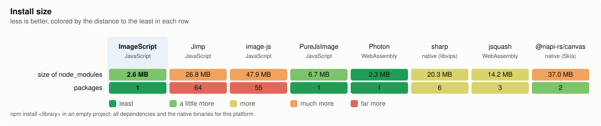
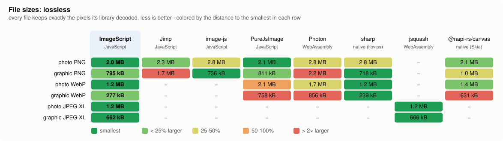

# ImageScript benchmark

How [ImageScript](https://github.com/imagescript/ImageScript) compares to other image libraries for Node.js: speed, file
sizes and what installing each takes. ImageScript is plain JavaScript with no dependencies, so it runs wherever
JavaScript does, like Jimp, image-js and PureJsImage; sharp and @napi-rs/canvas wrap native libraries (libvips, Skia),
Photon is WebAssembly, and so is jsquash (Squoosh's libavif and libjxl, for AVIF and JPEG XL).

## Numbers

Time per operation (less is faster), measured 2026-11-25 with Node.js v26.13.1 on AMD EPYC 9V45 96-Core Processor, ImageScript 4.0.1.

| | **ImageScript** | **Jimp** | **image-js** | **PureJsImage** | **Photon** | **sharp** | **jsquash** | **@napi-rs/canvas** |
|---|--:|--:|--:|--:|--:|--:|--:|--:|
| decode JPEG | **32 ms** | 94 ms | 107 ms | 80 ms | 32 ms | 10 ms | – | 14 ms |
| decode PNG | **19 ms** | 38 ms | 73 ms | 51 ms | 17 ms | 14 ms | – | 14 ms |
| decode WebP (lossy) | **47 ms** | – | – | 69 ms | 63 ms | 19 ms | – | 12 ms |
| decode AVIF | **138 ms** | – | – | 1.0 s | – | 61 ms | 144 ms | 42 ms |
| decode JPEG XL | **227 ms** | – | – | fails | – | – | 273 ms | 45 ms |
| decode animated GIF | **42 ms** | – | – | – | – | 50 ms | – | – |
| decode animated WebP | **161 ms** | – | – | – | – | 206 ms | – | – |
| encode JPEG (quality 80) | **41 ms** | 248 ms | 71 ms | 97 ms | 68 ms | 12 ms | – | 18 ms |
| encode PNG | **70 ms** | 156 ms | 190 ms | 407 ms | 68 ms | 100 ms | – | 354 ms |
| encode WebP (quality 80) | **134 ms** | – | – | 85 ms | – | 133 ms | – | 127 ms |
| encode WebP (lossless) | **831 ms** | – | – | 1.6 s | 27 ms | 991 ms | – | 350 ms |
| encode AVIF (quality 60) | **3.1 s** | – | – | 846 ms | – | 1.4 s | 1.5 s | – |
| encode JPEG XL (quality 90) | **1.3 s** | – | – | – | – | – | 1.6 s | – |
| encode JPEG XL (lossless) | **476 ms** | – | – | – | – | – | 285 ms | – |
| encode animated GIF | **154 ms** | – | – | – | – | 759 ms | – | – |
| encode animated WebP (q 80) | **645 ms** | – | – | – | – | 552 ms | – | – |
| resize to half | **8.4 ms** | 8.7 ms | 45 ms | 42 ms | 34 ms | 5.6 ms | – | 1.9 ms |
| resize to half, bicubic | **25 ms** | 93 ms | 192 ms | – | 48 ms | 6.0 ms | – | – |
| thumbnail (cover 400×400) | **8.9 ms** | 29 ms | – | 28 ms | – | 3.4 ms | – | 1.0 ms |
| crop | **0.92 ms** | 12 ms | 8.9 ms | 6.7 ms | 3.0 ms | 0.63 ms | – | 0.57 ms |
| rotate by 30° | **30 ms** | 367 ms | 458 ms | 313 ms | 131 ms | 26 ms | – | 12 ms |
| rotate by 90° | **8.9 ms** | 28 ms | 14 ms | 79 ms | 86 ms | 3.0 ms | – | 8.4 ms |
| flip | **1.6 ms** | 61 ms | 7.3 ms | 37 ms | 11 ms | 2.6 ms | – | 6.1 ms |
| blur (radius 5) | **43 ms** | 49 s | 447 ms | – | 93 ms | 9.5 ms | – | 14 ms |
| sharpen | **126 ms** | – | – | – | 64 ms | 118 ms | – | – |
| composite an overlay | **1.8 ms** | 20 ms | 6.0 ms | – | 3.7 ms | 3.5 ms | – | 1.1 ms |
| greyscale | **5.2 ms** | 74 ms | 10 ms | – | 4.2 ms | 15 ms | – | 3.0 ms |
| brightness and contrast | **6.9 ms** | 164 ms | – | – | 19 ms | 8.7 ms | – | 11 ms |
| render text | **0.36 ms** | – | – | – | – | 0.40 ms | – | 0.29 ms |
| render SVG | **103 ms** | – | – | – | – | 26 ms | – | 7.0 ms |
| thumbnail, keeping HDR | **106 ms** | – | – | – | – | 97 ms | – | – |

Encoded sizes:

| | **ImageScript** | **Jimp** | **image-js** | **PureJsImage** | **Photon** | **sharp** | **jsquash** | **@napi-rs/canvas** |
|---|--:|--:|--:|--:|--:|--:|--:|--:|
| photo PNG | 2.0 MB | 2.7 MB | 2.8 MB | 2.1 MB | 2.8 MB | 2.8 MB | – | 2.1 MB |
| photo JPEG | 218 kB, 40.6 dB | 260 kB, 40.9 dB | 260 kB, 40.9 dB | 222 kB, 40.5 dB | 257 kB, 40.4 dB | 218 kB, 40.6 dB | – | 218 kB, 40.6 dB |
| photo WebP | 1.2 MB | – | – | 2.1 MB | 1.7 MB | 1.2 MB | – | 1.4 MB |
| graphic PNG | 795 kB | 2.0 MB | 736 kB | 811 kB | 2.2 MB | 718 kB | – | 1.0 MB |
| graphic JPEG | 275 kB, 37.3 dB | 315 kB, 37.4 dB | 315 kB, 37.4 dB | 286 kB, 37.3 dB | 314 kB, 37.4 dB | 275 kB, 37.3 dB | – | 276 kB, 37.3 dB |
| graphic WebP | 277 kB | – | – | 758 kB | 856 kB | 239 kB | – | 631 kB |
| animation GIF | 825 kB, identical pixels | – | – | – | – | 720 kB, 45.6 dB | – | – |
| photo AVIF | 93 kB, 40.9 dB | – | – | 992 kB, 32.7 dB | – | 91 kB, 40.6 dB | 80 kB, 40.2 dB | – |
| photo JPEG XL | 245 kB, 44.5 dB | – | – | – | – | – | 227 kB, 44 dB | – |
| graphic AVIF | 147 kB, 41 dB | – | – | 709 kB, 38.5 dB | – | 114 kB, 38.7 dB | 136 kB, 40.5 dB | – |
| graphic JPEG XL | 230 kB, 43.4 dB | – | – | – | – | – | 193 kB, 41.8 dB | – |
| photo WebP lossy | 123 kB, 40 dB | – | – | 153 kB, 38.6 dB | – | 118 kB, 40.4 dB | – | 118 kB, 40.4 dB |
| photo JPEG XL lossless | 1.2 MB | – | – | – | – | – | 1.2 MB | – |
| graphic WebP lossy | 241 kB, 38.4 dB | – | – | 301 kB, 38 dB | – | 233 kB, 39 dB | – | 234 kB, 39 dB |
| graphic JPEG XL lossless | 662 kB | – | – | – | – | – | 666 kB | – |
| animation WebP | 529 kB, 33.6 dB | – | – | – | – | 683 kB, 33.1 dB | – | – |

| | **ImageScript** | **Jimp** | **image-js** | **PureJsImage** | **Photon** | **sharp** | **jsquash** | **@napi-rs/canvas** |
|---|---|---|---|---|---|---|---|---|
| kind | JavaScript | JavaScript | JavaScript | JavaScript | WebAssembly | native (libvips) | WebAssembly | native (Skia) |
| package | `imagescript@4.0.1` | `jimp@1.6.1` | `image-js@1.7.1` | `purejsimage@0.17.0` | `@silvia-odwyer/photon-node@0.3.4` | `sharp@0.35.5` | `@jsquash/avif@2.1.1 @jsquash/jxl@1.3.0` | `@napi-rs/canvas@1.1.0` |
| install size | 2.6 MB | 26.8 MB | 47.9 MB | 6.7 MB | 2.3 MB | 20.3 MB | 14.2 MB | 37.0 MB |
| packages | 1 | 64 | 55 | 1 | 1 | 6 | 3 | 2 |

## Method

- Inputs (in `inputs/`, sources in [inputs/SOURCES.md](inputs/SOURCES.md)): a 1920×1080 photo (JPEG, and made from it
  when the benchmark starts, PNG, lossy WebP, AVIF by sharp (libaom) and JPEG XL by jsquash (libjxl), at the
  qualities below), a 1434×1434 graphic with transparency (PNG), a 445×445 diagram with transparency placed on
  the photo (PNG), a 300×300 GIF with 101 frames (and made from it, an animated WebP by sharp at quality 80).
- Lossy WebP, AVIF and JPEG XL are encoded at the same nominal quality (80, 60 and 90); as the libraries'
  scales differ, the file sizes come with their PSNR (of the color over black, decoded by libwebp, libavif and
  libjxl). jsquash's libjxl runs at the effort ImageScript's default matches (cjxl's 5 lossy, 3 lossless; its own
  default is 7). PureJsImage's AVIF
  encoder has no quality option, and its JPEG XL decoder doesn't support everything libjxl's files use, which shows as
  failing. jsquash only encodes and decodes AVIF and JPEG XL (it gets the other inputs as pixels); @napi-rs/canvas
  decodes both with Skia's codecs, but doesn't encode them.
- Rendering: "The quick brown fox jumps over the lazy dog, 0123456789" in Source Sans 3 at 64px, and `tests/svgs/features.svg` (gradients, clipping,
  CSS) at 1920 pixels wide. Jimp, image-js, PureJsImage and Photon can't render TrueType/OpenType fonts or SVGs;
  @napi-rs/canvas (Skia's SVG module) ignores its CSS, so it draws a little less.
- Every operation starts from the same decoded image and returns a new one: libraries that change images in place
  clone first, sharp runs a pipeline from raw pixels back to raw pixels, PureJsImage (which has no decoded images) one
  from a BMP back to a BMP, @napi-rs/canvas draws into a new canvas. PureJsImage has no blur, composite, rendering or
  animated GIFs.
- Where the library lets you choose, resizing is bilinear (or bicubic, in its own row), the thumbnail covers 400×400
  (cropping the sides), blurring is gaussian with a radius or sigma of 5, sharpening an unsharp mask of radius or
  sigma 1 (Photon: its 3×3 sharpening kernel), rotating by 30° grows the image to fit, brightness and contrast go up
  20% (Jimp's and Photon's scales converted). image-js's and sharp's greyscale make one grey channel (and alpha). Each library uses its own defaults
  otherwise, e.g. its PNG compression level.
- Threads: ImageScript uses worker threads where they pay off (the processors available, at most 8), and sharp gets
  as many (`sharp.concurrency()`; its default on glibc Linux without jemalloc, like on CI, is one). The other
  libraries run on one thread (jsquash turns its threaded builds off in Node).
- [tinybench](https://github.com/tinylibs/tinybench), at least 1.5 seconds and 3 runs per measurement, every library
  in its own process.
- The release workflow runs the benchmark for every release and commits the results, on a GitHub Actions runner;
  runners vary, so compare libraries within one run rather than between runs.
- Install sizes: `npm install <library>` in an empty project, the apparent size of `node_modules`.

Run it: `npm install` in this directory, then `node run.js` (on an idle machine; `IMAGESCRIPT=local` measures
this checkout after `npm run build` instead of the version from npm; it runs `startup.js` too), `node installs.js` and `node report.js`.
